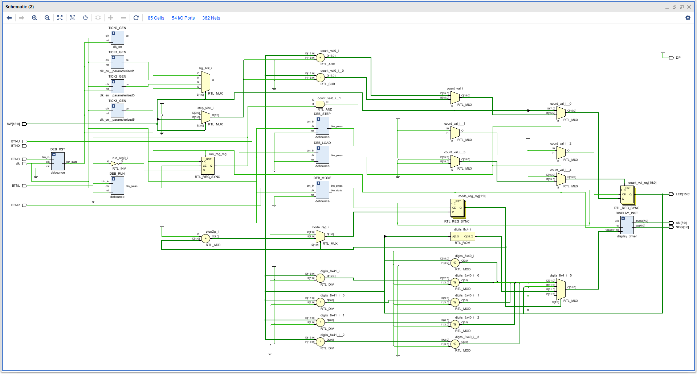
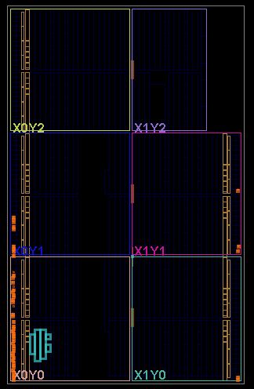
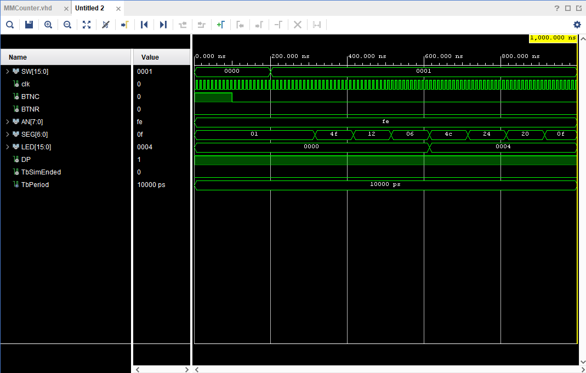
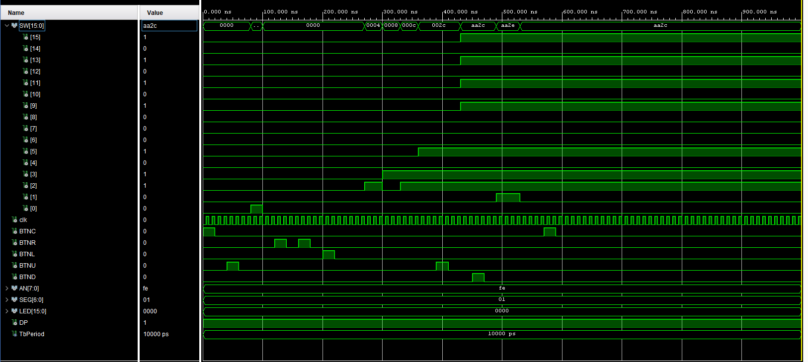
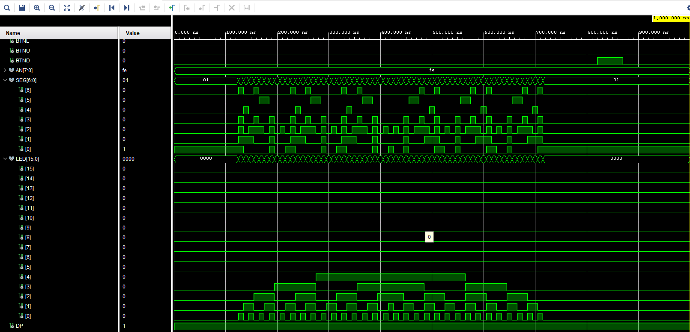

# Projekt 4: Multi-mode counter
* Autors: Nicholas Jarzabek, Vaclav Javurek, David Kevely
- [O projektu](./README.md#O-Projektu)
- [Popis funkčnosti tlačidiel](./README.md#Popis-funkčnosti-tlačidiel)
- [Blokove schema](./README.md#Blokove-schema)
- [Blokove schema generovane Vivadom](./README.md#Blokove-schema-generovane-Vivadom)
- [Implemented Design](./README.md#Implemented-design)
- [Simulace](./README.md#Simulace)
- [Video](./README.md#Video)
- [Vstupy a vystupy](./README.md#Vstupy-a-vystupy)
- [Importovane Subory](./README.md#Importovane-Subory)
- [Reference](./README.md#Reference)
# O Projektu
- projekt na základě přepínačů, zobrazuje na displeji hodnoty/text dle vybraného módu.
- `debounce` - umožňuje spolehlivé stisknutí tlačítka (zákmity ignorovány)
- `counter` - přiřazuje vybraným switchům bin. hodnoty
- `bin2seg` - přiřazuje bin. hodnotám  hodnoty, které chceme zobrazit, dle vybraného módu (1,2,3...,A,B...,F, nebo text, což pro ten mód přiřadíme více písmen)
- `bin2seg` - dle módu  a vst. z clk_en určí, které části segmentovek budou zhasnuty a rozsvíceny
- `display driver` - přepíná mezi řády (10 vs 1)

## Popis funkčnosti tlačidiel 
- změna módů, tlačítkem BTNR přepínáme multiplexer mezi módem 0,1,2->0,1,2, případně opačným směrem)
- sw(0) zapíná/vypíná čítač.
- sw(1) mění směr změny módů
- BTNC reset čítače
- mód 0 (hex) normálně zobrazujeme 0 až F
- mód 1 (dec) výst. omezen na 0 až 9
- mód 2 (text) Do displeje vchází pouze písmena, jejich "překlad" z clk_en signálu na písmena je v blocku counter v sekci "mod 2"

- `bin2seg` -dle módu  a vst. z clk_en určí, které části segmentovek budou zhasnuty a rozsvíceny
- `display driver` - přepíná mezi řády (10 vs 1)

## Blokove schema
- [Projekt 4: Multi-mode counter](./README.md#O-Projet-4:-Multi-mode-counter)
  

## Blokove schema generovane Vivadom
- [Projekt 4: Multi-mode counter](./README.md#O-Projet-4:-Multi-mode-counter)

## Implemented Design
- [Projekt 4: Multi-mode counter](./README.md#O-Projet-4:-Multi-mode-counter)
  

## Simulace 
- [Projekt 4: Multi-mode counter](./README.md#O-Projet-4:-Multi-mode-counter)

## Video 
- [Projekt 4: Multi-mode counter](./README.md#O-Projet-4:-Multi-mode-counter)

## Vstupy a vystupy   
- [Projekt 4: Multi-mode counter](./README.md#O-Projet-4:-Multi-mode-counter)
  
- `SW(0)` - zapnutí/vypnutí čítače
- `SW(1)` - přepínač směru změny módů (nahoru, dolů)
- `clk` - hodinový signál  (100 Mhz)
- `BTNC` - tlačítko čítače (reset)
- `BTNR` - mění módy směrem určeným SW(1)
- `AN` - anoda
- `SEG` -  segmentovka (které části segmentů svítí/nesvítí)
- `LED` - ledka (svítí/nesvítí)
- `DP` - desetinná tečka (svítí/nesvítí)

## Importovane Subory
- [Projekt 4: Multi-mode counter](./README.md#O-Projet-4:-Multi-mode-counter)
  
- clk_en.vhd
- counter.vhd
- debounce.vhd
- display_driver.vhd

## Napady na vylepšenie
- zvyšenie rychlosti
- manualne zadanie začiatočneho bitu pomocou switchov

## Reference
- [Projekt 4: Multi-mode counter](./README.md#O-Projet-4:-Multi-mode-counter)
  
- ChatGPT/Claude AI na omptimalizaci kodu a pomoc při potížích a implementaci kódu, když jsme nevědeli jak dal.
- [Online VHDL Testbench Template Generator](https://vhdl.lapinoo.net/)
- [Nexys A7 Digilent Reference](https://digilent.com/reference/programmable-logic/nexys-a7/start)
