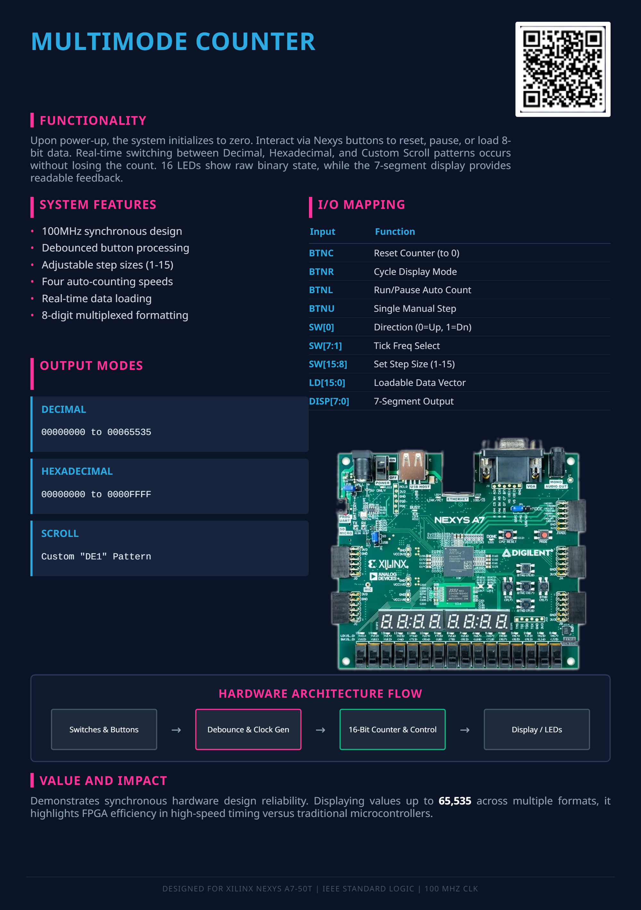
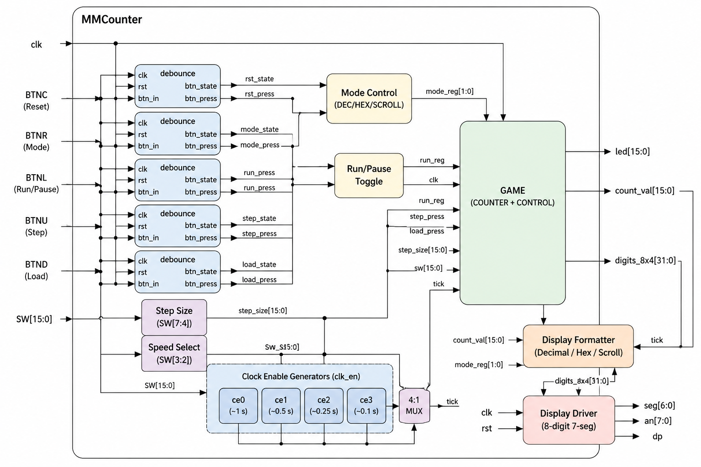

# Projekt 4: Multi-mode counter
* Autors: Nicholas Jarzabek, Vaclav Javurek, David Kevely
- [O projektu](./README.md#O-Projektu)
- [Popis funkčnosti tlačidiel](./README.md#Popis-funkčnosti-tlačidiel)
- [Blokove schema](./README.md#Blokove-schema)
- [Blokove schema generovane Vivadom](./README.md#Blokove-schema-generovane-Vivadom)
- [Implemented Design](./README.md#Implemented-design)
- [Simulace](./README.md#Simulace)
- [Video](./README.md#Video)
- [Vstupy a vystupy](./README.md#Vstupy-a-vystupy)
- [Importovane Subory](./README.md#Importovane-Subory)
- [Reference](./README.md#Reference)
## Poster 

# Project Overview
- Purpose: An FPGA-based 16-bit counter controlled via buttons and switches, displaying real-time values on an 8-digit 7-segment display and 16 LEDs.
- `debounce` - Ensures reliable button presses by filtering out mechanical switch bouncing, so one physical press equals exactly one logic pulse.
- `Clock Enable` - Generates timing pulses from the main 100MHz clock to control the speed of the automatic counting.
- `MMCounter` - The top-level module that ties the inputs (buttons/switches) to the counter logic and routes the formatted data to the displays.
- `bin2seg` - Translates 4-bit binary/hexadecimal values into the specific LED segment patterns required to display characters (0-9, A-F).
- `display driver` - Handles the rapid multiplexing (switching between anodes) required to show different numbers on all 8 digits of the 7-segment display simultaneously without flickering.

## Display Modes
- Mode 0 (Decimal): Converts the binary counter into a standard base-10 number, displaying values from 00000000 to 00065535.
- Mode 1 (Hexadecimal): Displays the raw 16-bit counter value in base-16, showing values from 00000000 to 0000FFFF.
- Mode 2 (Scroll text): A custom visual mode that displays a shifting "DE1" text pattern across the 7-segment display, animated by the current counter value.

## Block diagram

  

## Implemented Design
  

## Simulations

## Video 

## input/output 
- BTNC: Resets the entire system. It forces the counter back to 0 and resets the display mode to Decimal.
- BTNR: Cycles through the three display modes in this order: Decimal=>Hexadecimal=>text  back to Decimal.
- BTNL: Toggles the automatic counting on or off (Run/Pause).
- BTNU: Triggers a single, manual step of the counter (useful when auto-counting is paused).
- BTND: Loads an external 8-bit value directly into the counter from the upper switches.

- SW[0]: Sets the counting direction (0 = count up, 1 = count down).
- SW[3:2]: Selects the automatic counting speed. There are four speed tiers ranging from the slowest (00) to the fastest (11).
- SW[7:4]: Sets the step size for the counter (from 1 to 15). If all four switches are down (0000), the system defaults to a step size of 1.
- SW[15:8]: Acts as an 8-bit loadable data vector. When BTND is pressed, the binary value set on these switches is pushed into the counter.
  
- `clk` - clock signal  (100 Mhz)
- `AN` - anode
- `SEG` - segments
- `LED` - LED
- `DP` - Decimal Point

## Imported files 
- clk_en.vhd
- counter.vhd
- debounce.vhd
- display_driver.vhd

## Reference
- ChatGPT / Claude AI for code optimization, troubleshooting, and implementation assistance when we were stuck.
- [Online VHDL Testbench Template Generator](https://vhdl.lapinoo.net/)
- [Nexys A7 Digilent Reference](https://digilent.com/reference/programmable-logic/nexys-a7/start)
